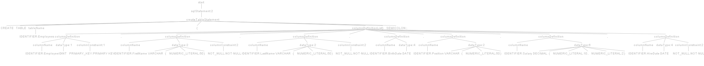

# Prosty Interpreter SQL z wykorzystaniem ANTLR

## Przegląd
Projekt ten dostarcza prosty interpreter **SQL** zaimplementowany za pomocą **ANTLR4**, zaprojektowany do współpracy z **Javą**. Obsługuje podstawowe operacje **SQL**, takie jak zapytania **SELECT**, dodawanie rekordów poprzez **INSERT**, usuwanie rekordów za pomocą **DELETE**, tworzenie tabel za pomocą **CREATE TABLE** oraz ich usuwanie z użyciem **DROP TABLE**. Gramatyka pozwala na analizę i zrozumienie zapytań **SQL** w strukturyzowany sposób. Projekt pozwala na generowanie drzewa parsowania.

## Funkcje
- **Zapytania SELECT** z opcjonalnymi klauzulami WHERE.
- **INSERT INTO** do dodawania nowych rekordów.
- **DELETE FROM** z opcjonalnymi klauzulami WHERE do usuwania rekordów.
- **CREATE TABLE** do tworzenia nowych tabel.
- **DROP TABLE** do usuwania tabel.

## Wymagania
- Java 8 lub nowsza
- ANTLR 4.8 lub nowszy

## Konfiguracja
Aby uruchomić ten projekt, musisz zainstalować ANTLR4 jako narzędzie generowania parserów i lexerów. Dodatkowo, jeśli używasz środowiska IDE takiego jak IntelliJ IDEA lub Eclipse, zaleca się zainstalowanie odpowiednich wtyczek ANTLR4.
Dzięki wtyczce ANTL4 przeznaczonej dla IntelliJ IDEA, użytkownik może uruchomić 

## Użycie
Aby uruchomić program należy najpierw sklonować repozytorium za pomocą systemu kontroli wersji GIT komendą - git clone https://github.com/PiotrBAGH/Lupin.git
Kolejnym krokiem jest otworzenie projektu w środowisku IntelliJ IDEA. Kolejnym krokiem jest zainstalowanie wtyczki ANTL v4. Aby to zrobić w pierwszym kroku należy przejść do sekcji File/settings/plugins.
Po zainstalowaniu wtyczki należy przejść do sekcji Tools i ustawić ścieżkę do której ANTLR będzie generował swoje pliki.

### Przykładowe Użycie
Aby przetestować parser, należy otworzyć plik gramatyka.g4 i otworzyć opcję "GENERATE ANTLR RECOGNIZER", po wykonaniu tego kroku należy wpisać przykładowe zapytanie SQL : 
```sql
SELECT * FROM tabela WHERE kolumna = 'wartość';
CREATE TABLE employees (
    id INT PRIMARY KEY,
    name VARCHAR(100),
    position VARCHAR(50)
);
INSERT INTO employees (id, name, position) VALUES
(1, 'John Smith', 'Manager'),
(2, 'Jane Doe', 'Developer'),
(3, 'Alice Johnson', 'Designer');
DROP TABLE employees;
```
## Przykładowe drzewa parsowania





